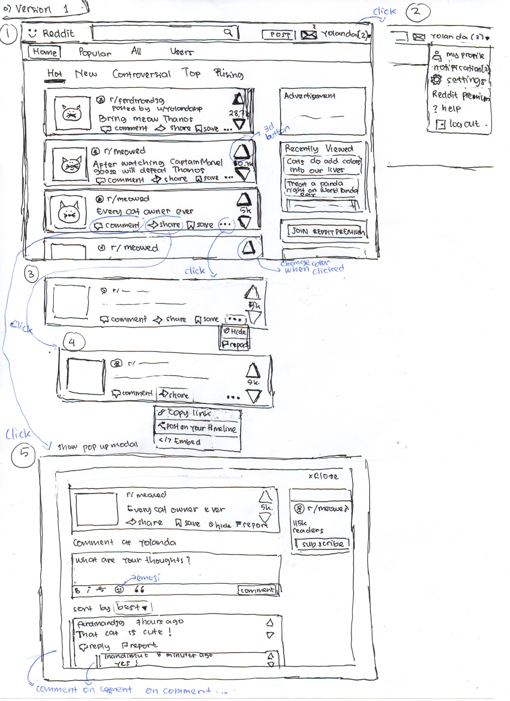
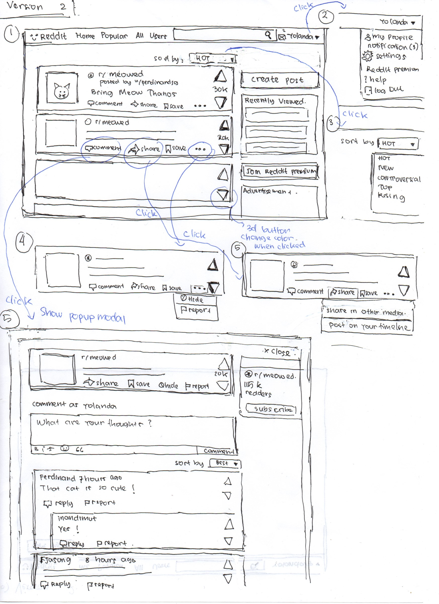
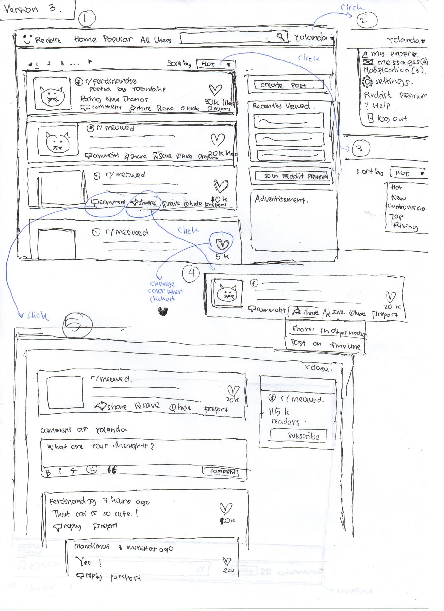
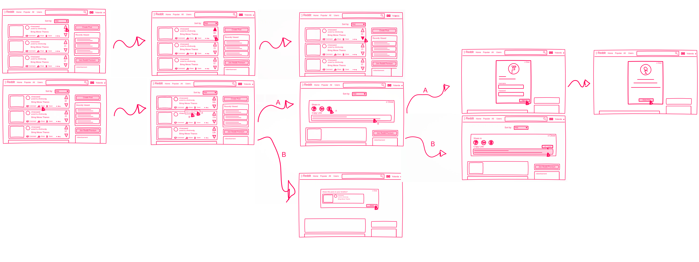

# Sketching and Prototyping
Using the information in the results of Assignment 1 for what is good and bad about the UI for designed tasks, we are going to make **Sketches** and **Prototypes**. These sketches and prototypes will lead to better design in Assignment 3. The prototypes will be then tested through a usability evaluation followed by design revision in Assignment 4.

## Part A: Sketches
Sketch at least **3 (three)** different UIs for the functions you are targeting. These three interfaces should be _dramatically different_ in terms of design directions. For example, they can be with different organizations of what functions on each screen or using a different layout of the icons, widgets, and menus on the screens. If you want, you can also incorporate non-on-screen UIs: physical buttons, gestures through motion sensors, etc.

You need **not** sketch the whole interface. It is not necessary for the sketches to have every function or every function in detail, but there should be enough to show off your general idea. **Be creative!** Draw your idea and label a few of the widgets so we can tell your intent. The goal is to have at least 3 good UIs in *interesting* ways. Sketches should be done on paper with pens and/or pencils (do not use a computer).

### 1. Scan/Photo of Sketches

**Sketch1**

**Sketch2**

**Sketch3**

### 2. Version Differences

**Problem**
- Hard to find search box
- Hard to find button for liking or voting a content
- The "Share" button is confusing, the button is not to share post to homepage/timeline
- Muted tones and cluttered, monotone text. The navigation is very difficult to understand

**Solution v1:**
- Move the search bar and "create a new post" to the top header
- Re-arrange Navbar, so Home, Popular, All Post, Users menu below nav Header and sorting based on Hot, New below the navbar.
- Rate button more noticeable
- Add icon to represent the function of the button
- Add dropdown menu for share button, so the users can choose where to share the post. There's 3 menu, copy link, embed, and post on timeline. Rename "crosspost" to "post on timeline" to share the post on the user's timeline.

**Solution v2:**
- Move the search bar button to the top header
- Move "create new post" button to the right section of page
- Home, Popular, All Post, Users menu on the left side of search bar. So there's one Navbar.
- Rate button more noticeable
- Add icon to represent the function of the button
- Add dropdown menu for share button, so the users can choose where to share the post. There's only 2 menu, share in other media (this include copy link and embed menu), and Post on timeline. Rename "crosspost" to "post on timeline" to share the post on the user's timeline.

**Solution v3:**
- Move the search bar button to the top header
- Move "create new post" button to the right section of page
- Home, Popular, All Post, Users menu on the left side of search bar. So there's one Navbar.
- Message menu is on the user dropdown menu
- Add pagination for posts, so no more infinite scrolling.
- Change icon for rate, from up and down icon to love icon.
- Add icon to represent the function of the button
- Add dropdown menu for share button, so the users can choose where to share the post. There's only 2 menu, share in other media (this include copy link and embed menu), and Post on timeline. Rename "crosspost" to "post on timeline" to share the post on the user's timeline.

### 3. Selected Sketch
I choose the **Solution v2**. Because it's simplycity and there's only one main navbar. I will not choose solution v3 because it's love button. Even the new users, who had no experience with Reddit before, might still think what's the function of up and down button, I think this up and down button is the characteristics of Reddit.

### 4. Design Rationale
These sketches are made by designer based on what users think or what users felt when using this website. By using these methods, we will know what's wrong with the interfaces and we should fix that problem. As much as possible we should make a new design that's better without removing the characteristics of the website.

## Part B: Assumptions
### 1. Hardware
1. Screen size: 15.6 inch
2. Screen resolution: 1366 x 768 or higher with screen ratio 16:9
3. PC with minimum requirement:
   - Intel Dual-Core
   - Intel HD Graphic
   - 2GB RAM
4. Physical input: Mouse or touch screen and Keyboard

### 2. Users
- Familiar with desktop computer and web browser.
- User age range from 12-50 years old.

## Part C: Prototypes
**Freehand**

https://projects.invisionapp.com/freehand/document/JXemUtHkD

**Prototype**
https://invis.io/SPR8IU15G3W
